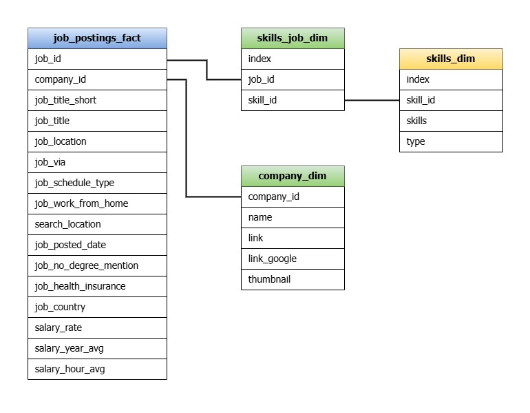

# Criando um RDB com PostgreSQL e <br/> Analisando Vagas de Emprego
Este projeto é baseado no curso *SQL for Data Analytics* do analista de dados [Luke Barousse](https://github.com/lukebarousse), o projeto consiste em criar um banco de dados relacional (RDB) utilizando *PostgreSQL* integrado com *VsCode*. Serão adicionados ao banco de dados arquivos .csv contendo informações sobre anúncios de vagas de emprego na área de dados no ano de 2023. 

## Introdução
### Sobre os Dados
Os dados para o projeto foram retirados de arquivos .csv disponíveis no [link](https://www.lukebarousse.com/sql) , sendo originalmente coletados no site desenvolvido pelo próprio Luke chamado [Top Skills for Data Nerds](https://www.datanerd.tech). <br/>
Como já citado, os dados incluem iformações sobre anúncio de vagas de empregos na área de dados no ano de 2023, sendo divididos em 4 tabelas contendo informações como *job_location* (localização do trabalho) e *skills* (habilidades ou ferramentas), além é claro do slário de cada vaga.

### Objetivos da Análise e Justificando o Uso do SQL
O objetivo desta análise é responder 5 perguntas referentes as vagas de empregos, sendo estas:

1. Quais empregos na área de dados possuem os maiores salários?
   
2. Quais as ferramentes mais populares entre analista, engenheiros e cientistas de dados
   
3. Quais ferramentas estão listadas nas vagas de analistas de dados com os maiores salários?
   
4. Qual a média salarial baseando-se apenas nas ferramentas exigidas na vaga?
   
5. Quais as melhores ferramentas para se aprender baseando nos dados?

O uso do SQL se faz necessário por conta da grande quantidade de dados que estamos trabalahando, além do que, o armazenamento dos dados em um banco de dados relacional facilita o trabalho dos analistas, dado sua organização e escalabilidade, dexando assim mais fácil análises futuras e possíves atualizações nos dados.

### Ferramentas Utilizadas
- **PostgreSQL:** Utilizado para criar e administrar o banco de dados.
  
- **Visual Studio Code:** Utilizado para compilar os códiogos e Querys em SQL.
  
- **SQL:** Utilizado em toda a parte de filtragem, ordenação e extração dos dados.
  
- **R:** Utilizado para a geração dos gráficos na análise.
  
- **Draw.io:** Utilizado para cirar o diagrama do banco de dados relacional.

## Criando o Banco de Dados
Os dados estão distribuídos em quatro tabelas, sendo a *job_postings_fact* a principal e com maior volume de dados, ela está conectada as tabelas *skills_job_dim* e *company_dim* pelas chaves *job_id* e *company_id*, sendo que *skills_job_dim* também está conecta a tabela *skills_dim* pela chave *skill_id* conforme mostra o diagrama abaixo.



Com isso, vamos primeiro conectar o *VsCode* com o *PostgreSQL*, a primeira vez será necessário criar um usuário e uma senha para o usuário administrador do banco de dados, por breviedade não entrarei em muitos detalhes nesta parte, mas criado o usuario, que nesta análise será nomeado *postgres*, e feito a conexão do PostgreSQL ao VsCode com as extensões *SQLTools* e *SQLTools Postgre*, podemos abrir uma janela no VsCode para executarmos as querys, o banco de dados é criado pelo comando:
```sql
CREATE DATABASE dados_vagas_emprego
```
Agora precisamos criar as tabelas, nessa hora é importante começar pelas tabelas que possuem apenas chaves primárias, dado que será necessário fazer referência a elas na criação das chaves secundárias das outras tabelas. Deste modo, conforme o diagarama acima, criaremos primeiro as tabelas *company_dim* e *skills_dim* com os seguintes comandos:
```sql
-- Cria a tabela company_dim com sua chave primária
CREATE TABLE public.company_dim(
    company_id INT PRIMARY KEY,
    name TEXT,
    link TEXT,
    link_google TEXT,
    thumbnail TEXT);

-- Cria a tabela skills_dim com sua chave primária
CREATE TABLE public.skills_dim(
    skill_id INT PRIMARY KEY,
    skills TEXT,
    type TEXT);
```
Feito isso, podemos criar a tabela *job_postings_fact*, onde ficará a maioria dos dados. Fazemos isso pelo comando abaixo, note que precisamos fazer referência a tabela *company_dim* na definição da chave estrangeira
```sql
-- Cria a tabela job_postings_fact com sua chave primária
CREATE TABLE public.job_postings_fact(
    job_id INT PRIMARY KEY,
    company_id INT,
    job_title_short VARCHAR(255),
    job_title TEXT,
    job_location TEXT,
    job_via TEXT,
    job_schedule_type TEXT,
    job_work_from_home BOOLEAN,
    search_location TEXT,
    job_posted_date TIMESTAMP,
    job_no_degree_mention BOOLEAN,
    job_health_insurance BOOLEAN,
    job_country TEXT,
    salary_rate TEXT,
    salary_year_avg NUMERIC,
    salary_hour_avg NUMERIC,
    FOREIGN KEY (company_id) REFERENCES public.company_dim (company_id));
```
Deste modo, podemos criar a última tabela, denotada por *skills_job_dim*, nela fazemos referência as tabelas *job_postings_fact* e *skills_dim* para inserção de chaves estrangeiras, por isso a deixamos por último.
```sql
-- Cria a tabela skills_job_dim table com a composição de uma chave primaria e uma chave estrangeira
CREATE TABLE public.skills_job_dim(
    job_id INT,
    skill_id INT,
    PRIMARY KEY (job_id, skill_id),
    FOREIGN KEY (job_id) REFERENCES public.job_postings_fact (job_id),
    FOREIGN KEY (skill_id) REFERENCES public.skills_dim (skill_id));
```
Criadas as tabelas, é preciso atribuir elas a um usuário que terá acesso ao banco de dados, este usuário terá a permição de consultar e alterar as tabelas, isto será feito no próximo passo, relembrando que nosso usuário foi nomeado de início como *postgres*.
```sql
ALTER TABLE public.company_dim OWNER to postgres;
ALTER TABLE public.skills_dim OWNER to postgres;
ALTER TABLE public.job_postings_fact OWNER to postgres;
ALTER TABLE public.skills_job_dim OWNER to postgres;
```
Agora para tornar mais eficiente o procesamento das Querys, podemos criar alguns indices em cada tabela.
```sql
CREATE INDEX idx_company_id ON public.job_postings_fact (company_id);
CREATE INDEX idx_skill_id ON public.skills_job_dim (skill_id);
CREATE INDEX idx_job_id ON public.skills_job_dim (job_id);
```
Feito isso, é possível conferir a criação de tabelas executando as Querys abaixo, uma de cada vez:
```sql
SELECT * FROM company_dim
SELECT * FROM skills_dim
SELECT * FROM job_postings_fact
SELECT * FROM skills_job_dim
```
Serão retornadas tabelas vazias, para adicionarmos os dados precisamos dos aquivos .csv disponiveis em [link](https://www.lukebarousse.com/sql), com isso executamos os comandos abaixo para adicionarmos os dados as tabelas criadas:
```sql
COPY company_dim --tabela a ser direcionada
FROM 'local do arquivo em seu computador' 
WITH (FORMAT csv, HEADER true, DELIMITER ',', ENCODING 'UTF8'); --especifica o formato e a formatacao

COPY skills_dim
FROM 'local do arquivo em seu computador'
WITH (FORMAT csv, HEADER true, DELIMITER ',', ENCODING 'UTF8');

COPY job_postings_fact
FROM 'local do arquivo em seu computador'
WITH (FORMAT csv, HEADER true, DELIMITER ',', ENCODING 'UTF8');

COPY skills_job_dim
FROM 'local do arquivo em seu computador'
WITH (FORMAT csv, HEADER true, DELIMITER ',', ENCODING 'UTF8');
```
No passo anterior pode ocorrer um erro na importação dos dados, devido as premiações do Postgre para o acesso a certos diretórios em seu computador, é importante verificar estas permições caso esse erro aconteça. <br/>
Agora podemos verificar novamente as tabelas, mas incluindo um limite de linhas por conta do volume de dados.
```sql
SELECT * FROM company_dim LIMIT 10
SELECT * FROM skills_dim LIMIT 10
SELECT * FROM job_postings_fact LIMIT 10
SELECT * FROM skills_job_dim LIMIT 10
```
Portanto, o banco de dados relacional está criado e os dados prontos para a análise.

## Análise dos Dados
Criado o banco de dados, podemos realizar nossas análise efetuando Querys para responder nossas perguntas iniciais, serão também utilizados gráficos criados com a biblioteca *ggplot2* do *R* para um melhor entendimento dos dados coletados.

### 1. Quais empregos na área de dados possuem os maiores salários?
Precisamos extrair do banco de dados as colunas conmtendo as infromações com o id da vaga de emprego, seu nome e ordenalos pola média salarial anual. Também vamos extrair mais algumas indormações com um `LEFT JOIN` entre as tabelas *ob_postings_fact* e *company_dim*, para ssim termos mais indromações sobre a companhia. Executamos a seguinte query:
```sql
SELECT	
    job_id,
	job_title,
	job_location, 
	job_schedule_type,
	salary_year_avg,
	job_posted_date
FROM
    job_postings_fact
LEFT JOIN company_dim ON job_postings_fact.company_id = company_dim.company_id
WHERE
    salary_year_avg IS NOT NULL
ORDER BY
    salary_year_avg DESC
LIMIT 10;
```
Com isso, me foi retornado uma tabela com os 10 empregos com as maiores médias salariais anuais. Pude extrair essa tabela em um arquivo .cvs e utilisa-las para fazer uma análise gráfica no R, executando os seguinte comandos:
```r
library(tidyverse)
library(forcats)

dados <- read.csv("local do arquivo .csv em seu computador")
view(dados)
colnames(dados)

dados %>%
  mutate(job_title = fct_reorder(job_title, salary_year_avg)) %>%
    ggplot(aes(x = salary_year_avg, y = job_title)) + 
    geom_bar(stat = "identity", fill = "blue") +
    labs(x = "Média Salarial Anual em Dólares", y = "Nome da Vaga",
         title = "Salários por Vaga na Área de Dados",
         subtitle = "Dados do ano de 2023",
         caption = "Escala em notação científica", )         
```
A biblioteca *forcats* serve apenas para organizar as barras no gráfico gerado, com isso me foi retornado o seguinte gráfico. Agora com o gráfico podenmos notar mais facilmente as relções das vagas com os salários.


- Primeiro notamos que os maiores salários são referentes as vagas de cientistas de dados, com as duas vagas de *Senior Data Scientist* somando masi de um milhão de dólares anuais, com a vaga *Data Scientist* sozinha somando mais de 900 mil dólares ao ano.
  
- A segunda area com os maiores salários são as de *Analistas de Dados*, possuindo salários anuais na casa dos 500 mil dólares.
  
- Embora apareça em menor quantidade nas vagas com os maiores salários, também há vagas de *Engenheiros de Dados*, com uma em particular de trabalho Hinbrido com salário que pode chegar até 600 mil dólares ao ano.

### 2. Quais as ferramentes mais populares entre analista, engenheiros e cientistas de dados?

Para responder a segunda pergunta efetuaremos a query abaixo, mudando apenas a clausula `job_title_short` dentro do `WHERE` para Analista, Cientista e Engenherio dr dados, efetuando assim três consultas ao banco de dados
```sql
SELECT 
    skills,
    COUNT(skills_job_dim.job_id) AS demand_count
FROM job_postings_fact
INNER JOIN skills_job_dim ON job_postings_fact.job_id = skills_job_dim.job_id
INNER JOIN skills_dim ON skills_job_dim.skill_id = skills_dim.skill_id
WHERE
    job_title_short = 'Data Analist' --mude para Data Scientist, Data Engenieer a cada Query
    AND job_work_from_home = True 
GROUP BY
    skills
ORDER BY
    demand_count DESC
LIMIT 5;
```
Efetuando a Query acima para cada tipo de vaga, conseguis as seguintes resultados:
#### Analista de Dados
Para anlistas de vagas a ferramenta mais exigida é o *SQL*, tendo quase o dobro de exigencias em vagas que *Exel* que fica em segundo lugar. Já em termos de linguagem de programação o *python* fica a frente do *R* que nem aparece entre as 5 ferramentas mais utilizadas.

| Ferramenta | Número de Vagas |
|------------|-----------------|
| sql        |       7.291     | 
| exel       |       4.611     |
| python     |       4.330     |
| tableau    |       3.745     |
| power bi   |       2.609     |

#### Cientista de Dados
Já para *Cientistas de Dados* temos de longe que a linguagem de programação mais popular novamente é o *python*, por causa de suas ferramentas para criação de algoritmos de aprendizado de máquina, apesar do *R* aparecer em terceioro lugar logo atráz do *Sql*, temos também um sistema de gerenciamento de dados em nuvem na lista, o *AWS* de propriedade da *Amazon*.

| Ferramenta | Numero de Vagas |
|------------|-----------------|
| python     |      10.390     |
| sql        |      7.488      |
| r          |      4.674      |
| aws        |      2.593      |
| tableau    |      2.458      |

#### Engenheiro de Dados
Agora para *Engenheiros de Dados* temos um enfoque maior em ferramentas de banco de dados, com agora dois seviços de gerenciamento de dados em nuvem, o *Azure* da *Microsoft* e o *AWS*, bem como *sql* e *python*.

| Ferramenta | Numero de Vagas |
|------------|-----------------|
| sql        |      14.213     |
| python     |      13.893     |
| aws        |      8.570      |
| azure      |      6.997      |
| spark      |      6.612      |

### 3. Quais ferramentas estão listadas nas vagas de analistas de dados com os maiores salários?
Agora será preciso filtrar quais ferramentas aparecem nas vagas com os maiores salários, assim extrairesmos estes dados para uma análise gráfica, e com isso termos um entendimento melhor.
```sql
WITH top_paying_jobs AS (
    SELECT	
        job_id,
        job_title,
        salary_year_avg,
        name AS company_name
    FROM
        job_postings_fact
    LEFT JOIN company_dim ON job_postings_fact.company_id = company_dim.company_id
    WHERE
        job_title_short = 'Data Analyst' AND 
        job_location = 'Anywhere' AND 
        salary_year_avg IS NOT NULL
    ORDER BY
        salary_year_avg DESC
    LIMIT 10)

SELECT 
    top_paying_jobs.*,
    skills
FROM top_paying_jobs
INNER JOIN skills_job_dim ON top_paying_jobs.job_id = skills_job_dim.job_id
INNER JOIN skills_dim ON skills_job_dim.skill_id = skills_dim.skill_id
ORDER BY
    salary_year_avg DESC;
```
Após executar esta Query, os dados foram extaridos em um arquivo .csv para serem anlisados no *R*, com isso foi construido um histograma com a frequancia na qual cada ferramenta aparece no eixo *x* e seu nome no eixo *y*, seguindo o código abaixo:
```r
library(tidyverse)
library(forcats)

dados <- read.csv("local do arquivo .csv em seu computador")
view(dados)
colnames(dados)

contagem = dados %>%
  count(skills)

contagem %>%
  mutate(skills = fct_reorder(skills, n)) %>%
  ggplot(aes(x = n, y = skills)) + 
  geom_bar(stat = "identity" , fill = "blue") +
  labs(x = "Frequência", y = "Ferramenta",
       title = "Frequência das Ferramentas Presentas nas Vagas com Maiores Salários",
       subtitle = "Dados do ano de 2023")

```
Pelo gráfico podemos notar que:
- O *Sql* segue como a linguagem para banco de dados relacionais mais popular, sendo assim bastante rexcomendada tela em seu currículo.
- O *Python* novamente se encontra ascima do *R* em uso, talvez por suas bibliotecas com ferramentas de inteligência artificial, um mercado com a demanda cada vez maior.
- *Azure* e *Aws* empatam como ferramentas de nuvem, sendo assim ambas ótimas opções.


### 4. Qual a média salarial baseando-se apenas nas ferramentas exigidas na vaga?
Vamos vereificar quaal o salários médio em uma vaga para quem sabe uma determinada ferramenta, sendo que vamos verificar vagas de Analistas, Cientistas e Engenheiros de dados. Para tal, executamos a seguinte Query:
```sql
SELECT 
    skills,
    ROUND(AVG(salary_year_avg), 0) AS avg_salary
FROM job_postings_fact
INNER JOIN skills_job_dim ON job_postings_fact.job_id = skills_job_dim.job_id
INNER JOIN skills_dim ON skills_job_dim.skill_id = skills_dim.skill_id
WHERE
    (job_title_short = 'Data Analyst'
    OR job_title_short = 'Data Scientist'
    OR job_title_short = 'Data Engineer')
    AND salary_year_avg IS NOT NULL
    AND job_work_from_home = True 
GROUP BY
    skills
ORDER BY
    avg_salary DESC
LIMIT 10;
```
Com os dados que obtemos da consulta podemos contruir a tabela abaixo, nela podemos notar que:
- Há uma grande demanda por conhecimento em banco de dados que não são baseados seomente em SQL, como *mongoDB* e *neo4j*, tornando evidente a manipulação de estruturas de dados mais complexas nestas vagas.
  
- Também se torna clara uma demanda por conhecimentos em legislação e regulamentos gerais de proteção de dados, o que fica evidente por *GPDR* estar em ssegundo lugar.
  
- De linguagens de programação temo o *R* com sua biblioteca *tidyverse*, o *Rust* que é uma linguagem de programação por si só assim como o *solidity*, deixando evidente uma demanda por conhecimentos de desenvolvimento de softwere.
  

| Ferramentas | Salário Médio Anual ($) |
|-------------|-------------------------|
| mongo       |   177.196               |
| gdpr        |   170.953               |
| neo4j       |   168.258               |
| bitbucket   |   167.539               |
| solidity    |   165.833               |
| tidyverse   |   165.513               |
| graphql     |   162.547               |
| opencv      |   162.083               |
| rust        |   161.879               |
| watson      |   161.471               |

### 5. Quais as melhores ferramentas para se aprender baseando nos dados?
Podemos combinar informações sobre demanda e salário para fromarmos uma Query para verificarmos quais as melhores ferramentas para se aprender para quem busca uma vaga como Analista, Cientista ou Engenheiro de dados. Para tal taréfa, foi montada a seguinte Query:
```sql
SELECT 
    skills_dim.skill_id,
    skills_dim.skills,
    COUNT(skills_job_dim.job_id) AS demand_count,
    ROUND(AVG(job_postings_fact.salary_year_avg), 0) AS avg_salary
FROM job_postings_fact
INNER JOIN skills_job_dim ON job_postings_fact.job_id = skills_job_dim.job_id
INNER JOIN skills_dim ON skills_job_dim.skill_id = skills_dim.skill_id
WHERE
    (job_title_short = 'Data Analyst'
    OR job_title_short = 'Data Scientist'
    OR job_title_short = 'Data Engineer')
    AND salary_year_avg IS NOT NULL
    AND job_work_from_home = True 
GROUP BY
    skills_dim.skill_id
HAVING
    COUNT(skills_job_dim.job_id) > 10
ORDER BY
    avg_salary DESC,
    demand_count DESC
LIMIT 10;
```
Com isso, montamos a seguinte tabela com as ferramenatas presentas nas vagas com os melhores salários de Analista, Cientista ou Engenheiro de dados.
| ID da Ferramenta | Ferramenta | Contador de Demanda | Salário Médio Anual ($) |
|------------------|------------|---------------------|-------------------------|
| 58               | neo4j      | 12                  | 168.258                 |
| 27               | golang     | 14                  | 156.321                 |
| 63               | cassandra  | 29                  | 154.581                 |
| 213              | kubernetes | 83                  | 153.447                 |
| 26               | c          | 65                  | 152.603                 |
| 219              | atlassian  | 14                  | 151.808                 |
| 101              | pytorch    | 126                 | 151.699                 |
| 99               | tensorflow | 136                 | 151.284                 |
| 94               | numpy      | 92                  | 150.080                 |
| 98               | kafka      | 150                 | 149.438                 |

## Conclusão
Ao decorrer deste texto conseguimos criar um banco de dados relacional, bem como responder perguntas imporatnates para quem quer entrar na área de dados, podendo assim tirar algumas conclyusões:

1. **Vags com os Maiores Salários :** As vagas com os maiores saláris são para cientistas de dados seniors e para analistas de dados.
 
2. **Ferramentas Populares em cada Área:** *Python* e *SQL* aparecem em nos pirmeiros lugares de ferramentas com maiores demandas, junto com alguma ferramenta de visualisação de dados como *Tableau* e alguma de nuvem como *AWS*.
   
3. **Ferramentas com os Maiores Salários:** Novamente SQL, Phython, Tableau aparecem no topo da lista das vagas de analistas de dados, o que era de se esperar dado a grande demanda por tais ferramentas.

4. **Ferramentas que Mais Pagam:** Aqui vemos algumas ferrmanetas pouco convencionais, como os bancos de dados  mongoDB e neo4j e linguagem de programação solidity.
   
5. **Melhores ferramentas para se aprender:** Por fim, conseguimos gerar uma tabela com as melhores ferramentas para se aprender, baseado em demanda e salário.
    

## O Que Eu Aprendi Durante o Projeto
Durtante o desenvolvimento deste projeto pude aprender várias coisas, bem como aprofunar meu conhecimento em R e SQL que eu adiquir nos cursos do *Google Data Analist Certificate*, em resumo aprendi sobre:
- **Criação de um banco de dados em PostgreeSQL:** Embora eu já tenha trabalho com SQL antes, eu sempre utilizei bancos de dados presentes no Google Cloud Plataform, sendo esta a primeira vez que tive a oportunidade de criar meu prórprio banco de dados relacional nativo em meu computador, desenvolvendo assim essa habilidade para projetos futuros.
  
- **Combinar Querys com Análises em R:** Outra habilidade importante desenvolvida durante o projeto foi a de combinar querys para a extraçaõ de amostras do conjunto de dados, com isso pude planejar a Query pensando já na análise posterior no *R*, combinando assim estas duas ferramentas.
  
- **Habilidades Analíticas:** Pude também desenvolver melhor minhas habiliades de análise, tais como fazer as perguntas certas para extrais o que se quer de um conjunto de dados tão extenso.


